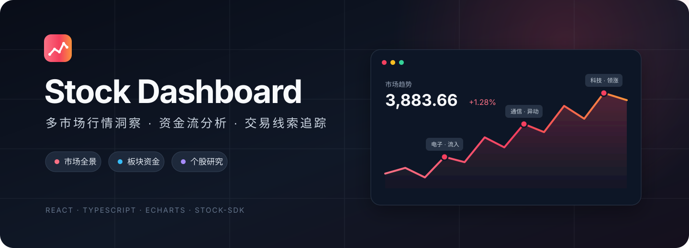

<p align="center">
  
</p>

<p align="center">
  <a href="https://github.com/WJMA-GIT/stock-dashboard/actions/workflows/deploy-pages.yml"></a>
  
  
  
</p>

<p align="center">
  面向盘中观察与复盘的多市场行情看板，把指数、资金、板块与个股信号收进一个清晰的工作台。
</p>

<p align="center">
  <a href="https://github.com/chengzuopeng/stock-dashboard"> chengzuopeng/stock-dashboard</a>
  ·
  <a href="https://wjma-git.github.io/stock-dashboard/"><strong>在线体验</strong></a>
  ·
  <a href="https://github.com/WJMA-GIT/stock-dashboard/issues">问题反馈</a>
</p>

## 核心能力

| 市场全景 | 资金与板块 | 个股研究 | 交易线索 |
| --- | --- | --- | --- |
| A 股与美股指数概览 | 行业/概念资金流榜单 | 分时、K 线与对比走势 | 连板天梯与龙虎榜 |
| 全市场成交额对比 | 板块热力图与详情 | 主力资金与大单结构 | 盘中异动与尾盘选股 |
| 涨跌分布与市场榜单 | 大盘分时行业异动标记 | 筹码峰与融资融券 | 条件扫描与自选告警 |
| 美股盘前、盘后观察 | 期货行情与资金结构 | 行业/概念穿透 | 自选分组与本地持久化 |

## 页面导航

| 页面 | 路径 | 主要内容 |
| --- | --- | --- |
| 总览 | `/` | 指数、成交额、市场宽度、大盘分时、资金与热点 |
| 热力图 | `/heatmap` | 行业、概念和自选维度的市场热度 |
| 榜单 | `/rankings` | 涨跌、成交、行业/概念资金流与主力净流入 |
| 连板天梯 | `/limit-up-ladder` | 涨停梯队、首板与行业分布 |
| 板块 | `/boards` | 行业/概念列表、走势、资金流与成分股 |
| 美股 | `/us-market` | 指数、盘前期指、盘后复盘、市场榜单与行业 ETF |
| 龙虎榜 | `/dragon-tiger` | 按交易日查看上榜个股及买卖席位净额 |
| 异动 | `/market-changes` | 盘中异动信号、类型筛选与个股定位 |
| 期货 | `/futures` | 连续合约、品种涨跌与买卖结构 |
| 自选 | `/watchlist` | 分组、批量管理、行情跟踪与本地告警 |
| 扫描 | `/scanner` | 股票池、信号模板与条件扫描 |
| 尾盘选股 | `/eod-picker` | 条件筛选与分时辅助判断 |
| 个股详情 | `/s/:code` | 行情、走势、资金、大单、筹码与两融数据 |

## 技术架构

```text
React 19 + TypeScript + Vite
├─ stock-sdk        行情与市场数据
├─ ECharts          分时、K 线与资金图表
├─ React Router     页面路由与详情穿透
├─ Framer Motion    轻量交互动效
└─ localStorage     自选、设置与筛选条件
```

数据请求统一由 `src/services/sdk.ts` 接入，集中处理缓存、重试与调用；关键行情页面按设置的刷新频率轮询。自选分组、告警及常用配置保存在浏览器本地，不依赖额外后端服务。

## 快速开始

环境要求：Node.js 20+、pnpm 10+。

```bash
git clone https://github.com/WJMA-GIT/stock-dashboard.git
cd stock-dashboard
pnpm install
pnpm dev
```

浏览器访问 `http://localhost:5173`。

## 常用命令

```bash
pnpm dev      # 启动开发服务器
pnpm build    # 类型检查并构建生产版本
pnpm lint     # 运行代码规范检查
pnpm preview  # 本地预览生产构建
```

## 项目结构

```text
src/
├─ components/      公共组件、图表与布局
├─ contexts/        主题、设置与板块共享数据
├─ hooks/           轮询、主题等通用逻辑
├─ pages/           业务页面
├─ router/          路由配置
├─ services/        stock-sdk 适配与本地存储
└─ utils/           格式化与通用工具
```

## 部署

仓库已配置 GitHub Pages 工作流：推送到 `main` 后自动安装依赖、构建并发布，站点路径由 `VITE_BASE_URL` 注入。`dist/404.html` 用于 GitHub Pages 下的 SPA 深链回退。

项目也保留了 `edgeone.json`，可在 EdgeOne Pages 使用相同构建产物部署到自定义域名。`GRAFANA_FARO_API_KEY` 为可选项，仅用于上传 sourcemap；未配置时不影响构建。

## 数据说明

行情与市场数据由 [stock-sdk](https://stock-sdk.linkdiary.cn/) 提供。数据存在延迟、缺失或源站调整的可能，本项目仅用于信息展示与技术交流，不构成任何投资建议。

---

<p align="center">
  <sub>Built for focused market observation.</sub>
</p>
